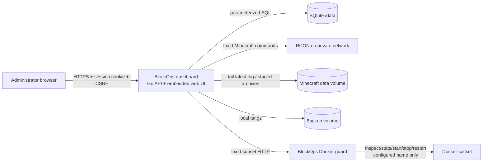

# Architecture

BlockOps is a single deployable dashboard plus a narrowly scoped Docker guard sidecar. The browser cannot address RCON, the Docker Engine, SQLite, or world files directly.

## Trust boundaries

1. **Browser to API:** All request data is untrusted. JSON bodies are size-bounded and reject unknown fields. Cookie sessions are opaque and HttpOnly; mutations require a per-session CSRF token. Every route carries the server it acts on in its path and resolves one `auth.Authorize` decision against the grant and lifecycle state read on that request: a caller who may not learn the server exists gets `404`, one who may but holds too small a role gets `403`. Server authorization is independent from UI visibility.
2. **API to RCON:** The API accepts Minecraft command text but sends it only through the RCON protocol. Player actions construct fixed command shapes after Java username/reason validation. No package imports `os/exec` and no host shell exists.
3. **API to world volume:** Paths derive from a validated configured world name, never request paths. ZIP/tar extraction rejects absolute/traversal paths, links, devices, unsupported file types, multiple worlds, and expanded-size limits. Replacement occurs in a same-filesystem staging directory with rollback.
4. **API to Docker guard:** The dashboard calls a fixed base URL and a configured container name. The guard independently checks that name and implements only the five required Docker operations. Only the guard mounts the socket.
5. **Secrets:** RCON credentials start in the environment. Browser-driven rotation is available only when a 32-byte external encryption key is configured; the resulting AES-256-GCM value is stored in SQLite and never returned to the browser or structured logs.

## Runtime ownership

- The main process owns HTTP server shutdown, hourly expired-session cleanup, and the console-tail goroutine through a signal-cancelled context.
- The console server ring contains 2,000 sanitized lines. Each WebSocket subscriber has a bounded channel; slow subscribers drop lines instead of applying unbounded memory pressure.
- The browser console also caps itself at 2,000 lines and defers search filtering.
- One mutex serializes backup, download, restore, and world-replacement operations to prevent overlapping save modes or directory swaps.
- Docker inspect and stats calls keep a 12-second client limit. Start, stop, and restart use a 45-second client limit because Docker receives a 30-second graceful-stop budget; the guard keeps a bounded 50-second response window around those calls.
- Audit pages use one SQLite query for server-side filters and `(occurred_at DESC, id DESC)` cursor traversal. CSV export reuses those bounded pages and closes each database read before writing to the network, so a slow download never holds SQLite's only connection.
- SQLite uses WAL, foreign keys, a busy timeout, and one connection to match the single-instance MVP. Multiple dashboard replicas are not supported.

## Consistency protocols

- If the container is running, backup/download sends `save-off`, then `save-all flush`, creates the archive, and attempts `save-on` with a fresh recovery context even if the request is cancelled.
- If the container is stopped, files are archived directly.
- Restore/replacement validates and extracts before downtime, stops the fixed container, renames current world directories into a rollback directory, installs staged directories, and starts the container. On installation or start failure, it removes the partial replacement, restores prior directories, and attempts a start.

## State model

SQLite stores users, password hashes, sessions, audit events, backup catalog entries, encrypted server secrets, and the fleet tables that give the configured server an identity: `nodes`, `servers`, `server_secrets`, and `server_grants`. Ordered migrations in `backend/internal/store/migrate.go` own the schema, migration 2 adopted the configured server as stored server one, and migration 3 made `audit_events` append-only and attributable. `audit_events` carries no foreign key, so deleting a server never deletes or blocks its history, and `BEFORE UPDATE` and `BEFORE DELETE` triggers raise: a migration that has to touch the table drops and recreates them inside its own transaction. Minecraft remains authoritative for player lists and vanilla permissions. Docker remains authoritative for lifecycle and resource metrics. BlockOps does not duplicate unavailable integration data with fabricated values.
