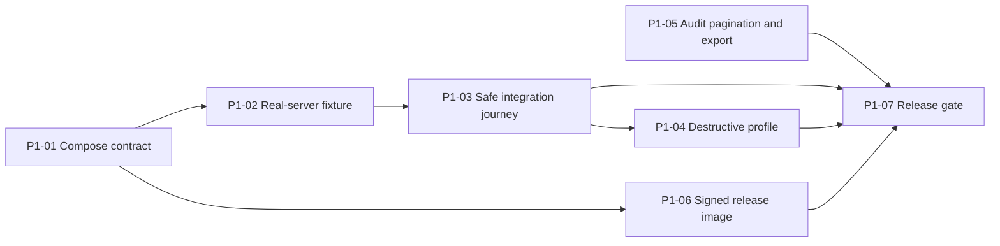

# Fleet implementation plan

This document turns the [roadmap](ROADMAP.md) into executable work without pretending later phases are already understood. Phase 1 has implementation tickets. Phase 2 has decisions that must be settled before its tickets exist. Phase 3 has one bounded spike. Phases 4 through 7 remain milestone summaries until their prerequisites land.

The current [delivery brief](DELIVERY_BRIEF.md) and [architecture](ARCHITECTURE.md) remain authoritative for the single-server MVP. This plan describes how to prove that release, then migrate it toward the fleet architecture without weakening current behavior.

## Planning rules

- Complete tickets in dependency order. A later ticket may start early only when it does not invent an unsettled contract.
- Keep each ticket releasable or hidden behind a backend-inaccessible seam. Do not merge a UI that implies unavailable backend behavior.
- Add no compatibility abstraction until two real implementations need it.
- Parse every HTTP, node, Docker, filesystem, and upstream response at its trust boundary.
- Keep method, path, request body, and response schema visible at frontend API call sites.
- Add one smallest runnable check for every branch, parser, migration, destructive path, or security decision.
- Update this plan at phase boundaries. Do not pre-split Phases 4 through 7 into speculative tickets.

## Ticket completion report

Every completed ticket records:

- What changed and why this is the simplest design that works.
- New files and the one responsibility of each.
- Database, state ownership, cache, permission, API, and deployment changes.
- Tests added and commands run.
- What was not verified.
- Old code or obsolete behavior deleted.

## Verification lanes

| Lane | Command or mechanism | Required for |
| --- | --- | --- |
| Backend | `cd backend && go test -race ./... && go vet ./...` | Every Go or API ticket |
| Frontend | `bun run --cwd frontend verify` | Every frontend ticket |
| Browser | Production Go binary plus the relevant Playwright spec | User-visible workflows |
| Compose | `docker compose config --quiet` plus service health assertions | Deployment tickets |
| Real integration | Disposable Minecraft server, RCON, shared data, Docker agent | Integration tickets |
| Repository | `git diff --check` | Every ticket |

Remote CI, real-server behavior, destructive flows, and release signatures must be reported separately. Passing unit tests cannot stand in for them.

## Phase 1: prove and ship the current product

### Critical path

P1-05 can run alongside the integration work. P1-04 may merge after its checks exist, but CI must not execute destructive scenarios by default.

| Ticket | Status | Depends on |
| --- | --- | --- |
| P1-01 | planned | None |
| P1-02 | planned | P1-01 |
| P1-03 | planned | P1-02 |
| P1-04 | planned | P1-03 |
| P1-05 | planned | None |
| P1-06 | planned | P1-01 |
| P1-07 | planned | P1-03, P1-04, P1-05, P1-06 |

### P1-01: make the Compose contract accurate

**Goal.** A normal `docker compose up` publishes only the dashboard, reports honest health for both BlockOps services, and handles an existing Minecraft data source predictably on Linux and Docker Desktop.

**Implementation.**

- Keep the dashboard on its dedicated non-internal ingress network plus the two private control networks. Only its loopback-bound HTTP port is published.
- Override the Docker guard health check to call `http://127.0.0.1:2375/health`. Do not change the image-wide dashboard health check.
- Document separate production commands for an absolute bind path and a pre-existing external named volume. Keep disposable volume creation in the integration Compose file from P1-02.
- Remove the ambiguous default that can silently create an empty production Minecraft volume or produce an unexplained existing-volume warning. Require the operator to select one documented source.
- Add a Compose config check for loopback ingress, unexposed RCON and guard ports, read-only roots, dropped capabilities, service-specific health checks, and required mounts.
- Update `.env.example`, `README.md`, and `docs/SECURITY.md` together so the documented deployment matches the rendered Compose model.

**Checks.**

- `docker compose config --quiet` passes for a named volume and an absolute bind path where supported.
- `docker compose ps` shows `127.0.0.1:8080->8080/tcp`, a healthy dashboard, and a healthy guard.
- Host requests reach the embedded React build, not the fallback asset page.
- Neither port 2375 nor 25575 appears in published host ports.

**Done when.** Linux and Docker Desktop follow the same documented startup path without manual network attachment.

### P1-02: add a disposable real-server fixture

**Depends on.** P1-01.

**Goal.** One command starts an isolated BlockOps stack and a real Minecraft Java server with deterministic credentials and disposable data.

**Implementation.**

- Add one integration-only Compose file with a pinned Paper-compatible server image digest, accepted EULA, private RCON, UID/GID `10001`, bounded memory, and no published RCON port.
- Publish the Minecraft game port on host loopback only so a developer can join during manual testing.
- Give the fixture a distinct Compose project name and disposable volumes so it cannot attach to production BlockOps or Minecraft state.
- Generate test-only RCON and BlockOps encryption secrets at runtime. Never commit them or print them in CI logs.
- Add a small orchestration command that starts the stack, waits on both service health checks and Minecraft's ready signal, and reports relevant logs on failure.
- Make cleanup explicit and scoped to the integration project. Do not remove images, unrelated containers, or external volumes.
- Document required Docker resources and the exact cleanup command.

**Checks.**

- A fresh run reaches BlockOps health, Docker inspect and stats, RCON `list`, `latest.log`, and the shared world root.
- A second run starts cleanly after the documented cleanup.
- Interrupting startup does not leave a running test project or expose RCON.

**Done when.** A contributor can reproduce the same fixture locally and in CI with one documented command.

### P1-03: add the safe real-integration journey

**Depends on.** P1-02.

**Goal.** A separate browser spec verifies available integrations without changing the existing mocked unavailable-integration journey.

**Implementation.**

- Add an opt-in Playwright project or spec selected by an explicit environment variable. Default `bun run --cwd frontend test:e2e` remains deterministic and mocked.
- Create the first administrator in the disposable database and verify the secure session flow.
- Assert the real server state, image, version, CPU and memory availability, disk availability, player catalog, and connected console stream.
- Execute only the fixed safe command `list`. Assert its response and audit event.
- Create a consistent backup, verify it appears in the catalog, download it, and verify a non-empty gzip archive without extracting it in the browser test.
- Assert that the server resumes saving after backup and remains online.
- Avoid page routing for integration endpoints. The test must fail if it accidentally intercepts overview, console, backup, Docker, or RCON behavior.
- Use unique usernames and disposable state so reruns cannot collide with prior users.

**Checks.**

- The mocked journey passes with integrations unavailable.
- The real journey passes with integrations available.
- Stopping RCON during a focused check produces an unavailable state and does not create a backup.
- Browser page errors and failed unexpected requests fail the spec.

**Done when.** CI can distinguish frontend behavior, backend behavior, and real Minecraft integration failures from each other.

### P1-04: add an explicit destructive profile

**Depends on.** P1-03.

**Goal.** Stop, restart, restore, and world replacement receive real integration coverage without running in the default test path.

**Implementation.**

- Require both the disposable project identity and `BLOCKOPS_E2E_DESTRUCTIVE=true`. Refuse to run when either guard is absent.
- Verify restart first, then stop and start, against only the fixture's managed Minecraft container.
- Create a known world marker, back it up, change it, restore the backup, and verify the original marker returns.
- Replace the world with a generated safe ZIP and verify the server starts with the replacement.
- Add focused failure cases for invalid archives and forced start failure while preserving rollback evidence.
- Capture Docker, BlockOps, and Minecraft logs on failure without exposing secrets.

**Checks.**

- The destructive spec cannot address a container name, project name, or data root supplied only by the browser.
- Restore and replacement prove both successful restart and rollback behavior.
- Cancelling Playwright does not strand Minecraft in `save-off` mode.

**Done when.** The destructive profile passes twice from fresh disposable state and remains absent from routine local and pull-request commands.

### P1-05: paginate and export the audit log

**Goal.** Administrators can traverse and export a growing audit history without loading a fixed newest-200 snapshot or weakening redaction.

**API contract.**

- Replace `GET /api/v1/audit?limit=200` with cursor pagination ordered by `(occurred_at DESC, id DESC)`.
- Accept a bounded `limit` and an opaque cursor. Return `{ events, nextCursor }`, omitting `nextCursor` on the last page.
- Keep outcome and search filtering server-side so pagination applies to the filtered result, not a client-only page.
- Add `GET /api/v1/audit/export` for a streamed CSV with the same allowed filters and a configured maximum range or row count.
- Escape spreadsheet formula prefixes in exported cells and keep structured details redacted before serialization.

**Implementation.**

- Add a composite SQLite index supporting the stable cursor order and selected filters.
- Encode the ordering tuple with the standard library. Treat cursors as untrusted input and reject malformed values.
- Change the frontend query to `useInfiniteQuery` only because the UI now consumes real pages. Do not wrap it in another state store.
- Preserve filters in router search parameters, reset the cursor when they change, and add an explicit Load more action before considering automatic infinite scroll.
- Stream CSV directly from the backend. Do not build the full export in browser or server memory.
- Update OpenAPI beside the handlers and schemas.

**Checks.**

- Store tests cover equal timestamps, insertion between page requests, malformed cursors, filter changes, final pages, and maximum limits.
- API tests cover authorization, CSV escaping, detail redaction, cancellation, and bounded exports.
- Frontend tests cover page append, retry without duplicate rows, filter reset, and export URL construction.
- Playwright covers two pages and a filtered export against seeded audit data.

**Done when.** A stable traversal never duplicates an event within one cursor chain, and exported cells cannot execute formulas when opened in a spreadsheet.

### P1-06: publish a verifiable release image

**Depends on.** P1-01.

**Goal.** A tag produces one immutable multi-architecture image plus evidence an operator can verify before deployment.

**Implementation.**

- Add a tag-triggered release workflow separate from pull-request CI.
- Build `linux/amd64` and `linux/arm64` from the existing multi-stage Dockerfile and publish by semantic version and digest.
- Generate an SPDX or CycloneDX SBOM and provenance through pinned GitHub Actions.
- Sign the image digest with keyless Sigstore signing under GitHub Actions OIDC.
- Attach checksums and concise verification commands to the release.
- Keep workflow permissions minimal and grant package or identity permissions only to the release job.
- Pin third-party actions to immutable commit SHAs before granting write or identity permissions.

**Checks.**

- A dry-run or prerelease tag builds both architectures.
- The runtime user remains `10001:10001`, the embedded frontend loads, and the image health check passes.
- Signature, provenance, SBOM, and digest verification succeed from a clean environment.
- Pull requests cannot publish or sign release artifacts.

**Done when.** The README documents a digest-pinned deployment and a copyable verification flow using the produced release.

### P1-07: make Phase 1 a release gate

**Depends on.** P1-03, P1-04, P1-05, and P1-06.

**Goal.** CI and documentation make it hard to regress the proven single-server release while Phase 2 changes its model.

**Implementation.**

- Keep backend, frontend, mocked browser, and container checks as separate failure domains.
- Add the safe real-integration journey to protected-branch CI after cheaper checks pass.
- Run the destructive profile on an explicit manual workflow and before a tagged release.
- Add a release checklist covering supported software, Docker Desktop, Linux, backup restore, world replacement, security headers, image verification, and documented unsupported cases.
- Record the tested Minecraft and server-software versions. Do not claim compatibility outside that matrix.
- Mark the Phase 1 roadmap exit criteria complete only after a tagged prerelease passes the full gate.

**Done when.** A release candidate has reproducible evidence for every Phase 1 exit criterion and lists anything not verified.

## Phase 2: decisions before implementation tickets

Phase 2 does not start with auth screens. It starts by fixing the resource and migration contracts that every later endpoint depends on. Record each decision in this document or a focused ADR only when the decision is made.

### D2-01: stable resource model and URL shape

Decide:

- Stable IDs and lifecycle states for servers and nodes.
- Whether `administrator` remains a global role or becomes a global owner plus per-server grants.
- The exact permission evaluation input: principal, action, server ID, and optional node ID.
- The canonical route shape, expected to be `/api/v1/servers/{serverId}/...` for server operations.
- How the current configured server becomes the first stored server without changing its Docker target, credentials, backups, or audit history.

Required proof:

- A role and resource matrix covering list, read, lifecycle, console, players, backups, files, software, assignments, nodes, and server creation.
- Negative API tests for enumeration and forged server IDs before the first multi-server UI ships.

### D2-02: versioned SQLite migrations

The current store applies idempotent `CREATE TABLE IF NOT EXISTS` statements without a schema version. Decide a standard-library migration mechanism before adding fleet tables.

Required properties:

- Ordered migrations run once inside transactions and record their version.
- Startup refuses a database newer than the binary.
- Backup and recovery instructions exist before the first destructive schema change.
- A copy of a current single-server database migrates forward in a test and preserves users, sessions, audit events, backups, and encrypted settings.
- Failed migration leaves the prior schema usable or emits a precise recovery procedure.

Do not add a migration dependency unless the small ordered SQL list becomes measurably inadequate.

### D2-03: human and automation principals

Decide separate records and authentication paths for:

- Local users with passwords, passkeys, TOTP, and recovery credentials.
- OIDC identities keyed by issuer and subject.
- API tokens stored only as hashes with explicit scopes and expiry.
- Browser sessions linked to one human user and authentication strength.

Define reauthentication requirements for ownership transfer, MFA changes, recovery-code regeneration, node enrollment, server deletion, and sensitive-file access.

### D2-04: node enrollment and certificate lifecycle

Decide:

- Which process owns the internal certificate authority and how its key is backed up.
- Enrollment token entropy, expiry, single-use semantics, and audit events.
- Node certificate subject, allowed uses, rotation overlap, revocation lookup, and clock-skew policy.
- The agent-to-control-plane protocol bootstrap and how an operator verifies the node fingerprint before approval.

The browser never receives node private keys, enrollment secrets after use, or control-plane signing material.

### D2-05: audit and job identity

Define immutable fields before fleet work produces events:

- Principal type and ID.
- Server and node IDs.
- Request, job, operation, and attempt IDs.
- Action, target, source, timestamps, outcome, and redacted details.

Decide which fields are required for synchronous requests, scheduled work, agent work, retries, and system recovery. Preserve the human username as display history, not identity authority.

### Phase 2 planning gate

Write Phase 2 implementation tickets only after all five decisions have:

- Reviewed schemas and API examples.
- A migration and rollback story for current installations.
- A threat model covering horizontal privilege escalation, confused-deputy requests, token theft, certificate theft, and audit ambiguity.
- One runnable negative authorization prototype using two users and two server records.

## Phase 3: bounded provisioning spike

The spike answers whether the existing standard-library Docker client can safely grow into a typed agent. It is not a hidden production provisioning endpoint.

### Questions

- Can a closed `ServerSpec` produce all required Docker create requests without exposing maps of arbitrary environment variables, mounts, labels, ports, or commands?
- Can labels and generated names bind every inspect and lifecycle action to one server ID?
- Can the agent reserve a port, create isolated volumes and networks, start a pinned runtime image, and clean up every partial failure idempotently?
- Can Vanilla and Paper run concurrently from two specs using the same runtime implementation?
- Which agent state must persist locally when the control plane disconnects?

### Spike shape

- Add no frontend.
- Add no public control-plane route.
- Use one closed Go `ServerSpec` with only the fields required for Vanilla and Paper.
- Extend the existing HTTP-over-Unix-socket client instead of adding a Docker SDK unless the Engine API cannot be expressed clearly with the standard library.
- First test requests against `httptest` to assert the exact Docker API method, path, body, labels, limits, mounts, and rejection behavior.
- Then run a disposable Docker integration check that provisions two loopback-bound servers with separate volumes, ports, RCON secrets, and ownership labels.
- Inject a failure after each create step and prove repeated cleanup reaches the same empty result.
- Persist only the minimum local operation journal needed to answer restart recovery. A single JSON file is acceptable for the spike if atomic replacement suffices.

### Spike exit

Produce:

- Captured request and state-machine evidence.
- A list of Docker Engine APIs the production agent needs.
- The smallest persisted job and ownership model that survived failure injection.
- Measured startup, cleanup, and reconnect behavior.
- A decision to promote, rewrite, or delete the spike code.

Do not start Phase 3 implementation tickets until Phase 2 authorization and migration work has landed. Delete spike code that does not belong in the chosen production boundary.

## Later-phase planning gates

### Phase 4: Modrinth

Detail Phase 4 only after two server types are provisioned from stored specs. The plan must start with a pure resolver that consumes recorded server version and loader data and returns a reviewable, hash-pinned install plan. It must settle CDN redirect policy, dependency conflict behavior, lockfile ownership, and rollback before UI work.

### Phase 5: virtual file explorer

Detail Phase 5 only after every server has an agent-owned root and file permissions exist in the Phase 2 model. Start with a path-jail and race-resistance proof using symlink swaps, archive traversal, and cross-server attempts. Listing and text read follow. Writes, moves, trash, sensitive paths, and large streaming transfers follow only after the proof holds.

### Phase 6: multi-node gateway

Detail Phase 6 only after the local agent provisions and recovers jobs correctly. Start with one remote node, outbound mTLS, duplicate job delivery, reconnect, and revocation. Manual placement comes before automatic scheduling. High availability remains out of scope.

### Phase 7: fleet operations

Detail Phase 7 from measured fleet needs. Backup scheduling comes first because it reuses proven recovery semantics. Metrics history, diagnostic parsing, curated settings, and richer player integrations remain separate tickets rather than one operations framework.

## Plan maintenance

- Update ticket status in this file as `planned`, `in progress`, `blocked`, or `complete`.
- Add newly discovered work only when it blocks a phase exit criterion or prevents safe operation.
- Move optional improvements to the roadmap instead of expanding an active ticket.
- At each phase exit, remove obsolete assumptions, record actual constraints, and write only the next phase's detailed tickets.
