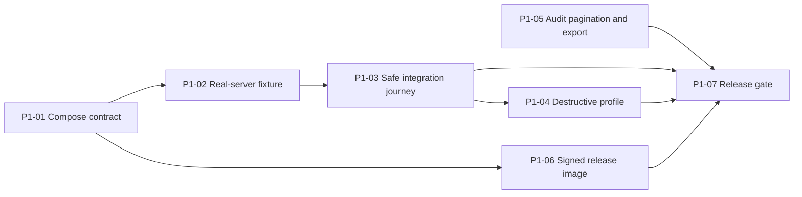
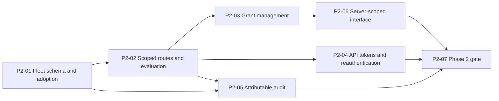

# Roadmap

BlockOps grows from a secure single-server dashboard into a self-hosted Minecraft fleet manager, keeping the Go control plane, React interface, typed HTTP APIs, bounded WebSocket streams, and audit model.

Phases follow dependencies and risk, not dates. A phase starts only after the previous one meets its exit criteria. Phases 1 and 2 have tickets. Phases 3 through 7 are outcomes and constraints, not plans.

[VoxelDash](https://github.com/gnmyt/VoxelDash) is product inspiration for provisioning, Modrinth integration, file management, schedules, and performance history. BlockOps implements those around explicit server roots, pinned runtime templates, resource-scoped permissions, and authenticated node agents.

## Product rules

- The browser connects only to the central control plane. Never to Docker, node agents, RCON, or server files.
- Every server gets its own identity, data root, port allocation, credentials, resource limits, permissions, and audit history.
- Prefer typed operations over arbitrary commands, paths, images, mounts, container names, or download URLs.
- Local users, browser sessions, API tokens, and node identities are separate security principals.
- Resolve upstream artifacts from approved APIs, pin immutable versions, verify hashes before installation.
- Detect capabilities and show unavailable states instead of guessing across Vanilla, Paper, Purpur, Spigot, Fabric, Forge, and NeoForge.
- Every phase needs a threat model, migration plan, and runnable integration check.

## Explicitly rejected

These are boundaries, not backlog items. Adding one requires a separate product decision, not a ticket.

- Browser shell, SSH, SFTP, Docker exec, or host command execution.
- Arbitrary host paths, container images, Docker options, startup commands, scripts, webhooks, or download URLs.
- Direct editing of another server's files, or shared mutable server roots.
- Automatic Minecraft, loader, mod, or plugin upgrades without compatibility review and rollback.
- Partial `.mca` region restoration presented as safe whole-world recovery.
- AI-generated operational changes without deterministic validation and explicit operator approval.
- Commercial hosting, billing, reseller, or hostile customer-tenancy features.
- Kubernetes orchestration, high-availability control-plane replicas, direct browser-to-agent connections.

Future work adds narrow interfaces for its own operations. It must not turn the node agent, file explorer, software catalog, or scheduler into a generic remote administration surface.

## Current baseline

The MVP provides Argon2id local accounts, revocable HttpOnly sessions, CSRF protection, login throttling, three roles, live monitoring, bounded console streaming, RCON commands, player controls, safe world operations, local backups, constrained lifecycle actions, encrypted RCON credential rotation, and an audit log for one configured Docker server. See [ARCHITECTURE.md](ARCHITECTURE.md) and [SECURITY.md](SECURITY.md).

This is real authentication. Fleet management expands it with resource-scoped authorization and machine identity. It does not replace it with a shared panel password or browser-supplied roles.

## Phase 1: prove and ship the current product

**Outcome.** An operator deploys a tagged release beside a real server and verifies every integration before the fleet model changes persistence and authorization.

P1-01 through P1-07 are `complete`.

### P1-01: make the Compose contract accurate (complete)

A normal `docker compose up` publishes only the dashboard and reports honest health for both services on Linux and Docker Desktop.

- Dashboard on its ingress network plus the two private control networks. Only its loopback-bound HTTP port is published.
- Guard health check calls `http://127.0.0.1:2375/health`. Leave the image-wide dashboard check alone.
- Document separate production commands for an absolute bind path and a pre-existing external named volume. Remove the default that can silently create an empty production Minecraft volume.
- Add a Compose config check for loopback ingress, unexposed RCON and guard ports, read-only roots, dropped capabilities, and required mounts.
- Update `.env.example`, `README.md`, and `SECURITY.md` in the same change.

**Done when.** Both platforms follow the same documented startup path with no manual network attachment, and neither 2375 nor 25575 appears in published host ports.

### P1-02: add a disposable real-server fixture (complete)

Depends on P1-01. One command starts an isolated stack and a real Minecraft Java server with deterministic credentials and disposable data.

- One integration-only Compose file: pinned Paper-compatible image digest, accepted EULA, private RCON, UID/GID `10001`, bounded memory, no published RCON port. Game port on host loopback only.
- Distinct Compose project name and disposable volumes so it cannot attach to production state.
- Generate test-only RCON and encryption secrets at runtime. Never commit them or print them in CI logs.
- Orchestration command waits on both health checks and Minecraft's ready signal, and reports logs on failure. Cleanup is explicit and scoped to the integration project.

**Done when.** A contributor reproduces the fixture locally and in CI with one documented command, and a second run starts cleanly after cleanup.

The fixture is not hermetic. `itzg/minecraft-server` is pinned to a multi-architecture index digest and the Minecraft version is pinned, but the Paper build itself is resolved from `api.papermc.io` on each first boot, so Minecraft needs a plain egress network beside the internal RCON one. P1-07 records the tested build.

### P1-03: add the safe real-integration journey (complete)

Depends on P1-02. A separate browser spec verifies available integrations. The existing mocked unavailable-integration journey stays untouched.

- Opt-in Playwright project selected by an environment variable. Default `bun run --cwd frontend test:e2e` stays deterministic and mocked.
- Assert real server state, image, version, CPU/memory, disk, player catalog, and a connected console stream.
- Execute only the fixed safe command `list`. Assert its response and audit event.
- Create a consistent backup, verify catalog and download, and assert the server resumes saving and stays online.
- No page routing for integration endpoints. The test must fail if it accidentally intercepts real behavior.
- Poll for software and version rather than asserting once. Paper answers RCON `version` asynchronously, so `operations.parseVersion` returns empty strings for the first seconds after the fixture reports healthy, while state, metrics, disk, and the player catalog are already correct.

**Done when.** CI distinguishes frontend, backend, and real Minecraft integration failures from each other.

`frontend/e2e/integration.spec.ts` runs under the `integration` Playwright project, selected only by `BLOCKOPS_E2E_INTEGRATION=true`; the default lane resolves to the `mocked` project and cannot load the integration spec. The spec removes `page.route` and `page.routeWebSocket` from the page, so an accidental handler throws.

Two constraints the fixture settled. Nothing ever joins the fixture, so the real player catalog is legitimately empty and the journey asserts the parsed empty catalog rather than a player. Save consistency is observable without a second command: Paper writes `[Rcon: Automatic saving is now disabled]`, `[Rcon: Saved the game]`, and `[Rcon: Automatic saving is now enabled]` to `latest.log`, so the console proves the backup re-enabled saving.

### P1-04: add an explicit destructive profile (complete)

Depends on P1-03. Stop, restart, restore, and world replacement get real coverage outside the default test path.

- Require both the disposable project identity and `BLOCKOPS_E2E_DESTRUCTIVE=true`. Refuse to run when either guard is absent.
- Restart first, then stop and start, against only the fixture's container.
- Write a world marker, back it up, change it, restore, verify the marker returns. Replace the world with a generated safe ZIP and verify startup.
- Cover invalid archives and forced start failure while preserving rollback evidence.

**Done when.** The profile passes twice from fresh disposable state, cancelling Playwright never strands Minecraft in `save-off`, and it stays absent from routine and pull-request commands.

`frontend/e2e/destructive.spec.ts` runs only when the integration flag, destructive flag, and exact `blockops-integration` project identity agree. It also reads the protected deployment settings and refuses to act on any container except `blockops-integration-minecraft`. The journey uses a downloaded real `level.dat` to generate minimal replacement ZIPs, proves a backup restores its marker, and proves a traversal ZIP leaves that marker untouched. Focused Go tests force the replacement start to fail and assert the old world returns before the recovery start, then cancel an archive request and assert `save-on` uses a fresh context. The lane passed twice from newly created volumes in 3.0 and 2.9 minutes; the existing safe journey also passed after the destructive flow and confirmed the full `save-off` and `save-on` cycle.

### P1-05: paginate and export the audit log (complete)

Administrators traverse and export a growing history without a fixed newest-200 snapshot.

- Replace `GET /api/v1/audit?limit=200` with cursor pagination ordered by `(occurred_at DESC, id DESC)`. Bounded `limit`, opaque cursor, `{ events, nextCursor }`.
- Keep outcome and search filtering server-side so pagination applies to the filtered result.
- Add `GET /api/v1/audit/export` streaming CSV with the same filters and a configured maximum. Escape spreadsheet formula prefixes. Keep details redacted.
- Composite SQLite index for the cursor order. Encode the tuple with the standard library and treat cursors as untrusted input.
- Frontend moves to `useInfiniteQuery` because the UI now consumes real pages. Filters stay in router search params and reset the cursor. Explicit Load more before considering infinite scroll.
- Update OpenAPI beside the handlers.

**Done when.** A stable traversal never duplicates an event within one cursor chain, and exported cells cannot execute formulas in a spreadsheet.

The API now applies outcome and literal search filters before `(occurred_at DESC, id DESC)` cursor traversal. Existing exact-second timestamps migrate to the fixed-width UTC form used by new events, so SQLite text order stays chronological. The dashboard keeps filters in the URL, keeps cursors in `useInfiniteQuery`, and loads each next page only when an administrator selects **Load more**. CSV export reuses the filtered page query, stops at `BLOCKOPS_MAX_AUDIT_EXPORT_ROWS`, reads stored redacted details, and prefixes spreadsheet formula cells. Store, boundary, CSV, config, frontend, and production-binary browser checks cover the flow.

### P1-06: publish a verifiable release image (complete)

Depends on P1-01. A tag produces one immutable multi-architecture image plus verifiable evidence.

- Tag-triggered workflow separate from pull-request CI. Build `linux/amd64` and `linux/arm64`, publish by semantic version and digest.
- SBOM and provenance through pinned actions. Keyless Sigstore signing under GitHub Actions OIDC. Checksums and verification commands on the release.
- Minimal workflow permissions. Pin third-party actions to commit SHAs before granting write or identity permissions.

**Done when.** The README documents a digest-pinned deployment and a copyable verification flow, the runtime user is still `10001:10001`, and pull requests cannot publish or sign.

The tag-only release workflow accepts stable `vMAJOR.MINOR.PATCH` tags, publishes one `linux/amd64` and `linux/arm64` image index to GHCR, and addresses it by the exact version or digest. BuildKit attaches a per-platform SPDX SBOM and SLSA provenance. Cosign signs the image digest through GitHub Actions OIDC. The GitHub release records that digest, exports both attestations for each platform, checksums every evidence file, and includes copyable verification commands. Every action has an immutable commit SHA, and only the tag job receives package, release, and identity write permissions.

### P1-07: make Phase 1 a release gate (complete)

Depends on P1-03, P1-04, P1-05, P1-06.

- Backend, frontend, mocked browser, and container checks stay separate failure domains.
- Safe integration journey runs in protected-branch CI after cheaper checks. Destructive profile runs on manual workflow and before a tagged release.
- Release checklist covers supported software, both platforms, restore, world replacement, security headers, image verification, and documented unsupported cases.
- Record the tested Minecraft and server-software versions. Do not claim compatibility outside that matrix. P1-03 exercised Paper `1.21.4-232` on Minecraft 1.21.4, resolved from the pinned `itzg/minecraft-server:java21` index digest.

**Done when.** A release candidate has reproducible evidence for every Phase 1 exit criterion and lists anything not verified.

The tag workflow reuses the backend, frontend, mocked browser, container, and safe real-server CI jobs. It then runs the destructive profile against a fresh fixture before the publish job receives write or OIDC permissions. The same workflow can run manually without publishing. The mocked production-browser lane checks the full security-header set. The fixture pins Paper 1.21.4 build 232 on Minecraft 1.21.4 and the recorded `itzg/minecraft-server` image index. [`RELEASE.md`](RELEASE.md) maps each release check to its evidence and names the unverified platforms and software.

## Phase 2: fleet identity and authorization

**Outcome.** Users and nodes have explicit identities, and every operation is authorized against a specific server before multi-server provisioning exists.

Phase 2 does not start with auth screens. It starts by fixing the contracts every later endpoint depends on. Write tickets only after all five decisions have reviewed schemas, a migration and rollback story for current installations, a threat model covering horizontal privilege escalation and confused-deputy requests, and one runnable negative authorization prototype using two users and two servers.

D2-01 through D2-05 are decided in [`PHASE2.md`](PHASE2.md), which holds the schemas, the migration and rollback story, and the threat model. D2-02's mechanism ships with that document in `backend/internal/store/migrate.go`. The negative authorization prototype is `auth.Authorize` in `backend/internal/auth/scope.go` with its two-user, two-server test. The tickets below follow from it and resolve the three questions that document left open: a slug is never reused after deletion, fleet and per-server audit share one export limit, and `provisioning` and `failed` servers are visible to their grant holders.

- **D2-01 Resource model.** Stable IDs and lifecycle states for servers and nodes. Whether `administrator` stays global or becomes global owner plus per-server grants. The permission evaluation input. The canonical route shape, expected to be `/api/v1/servers/{serverId}/...`. How the currently configured server becomes the first stored server without changing its Docker target, credentials, backups, or audit history.
- **D2-02 Versioned migrations.** The store applies idempotent `CREATE TABLE IF NOT EXISTS` with no schema version. Decide a standard-library mechanism: ordered migrations run once in transactions and record their version, startup refuses a database newer than the binary, failure leaves the prior schema usable. Prove a copy of a current database migrates forward with users, sessions, audit, backups, and encrypted settings intact. No migration dependency unless an ordered SQL list becomes measurably inadequate.
- **D2-03 Principals.** Separate records and authentication paths for local users, OIDC identities keyed by issuer and subject, hash-only API tokens with scopes and expiry, and browser sessions linked to one human. Define reauthentication for ownership transfer, MFA changes, recovery-code regeneration, node enrollment, server deletion, and sensitive-file access.
- **D2-04 Node enrollment.** Who owns the internal CA and how its key is backed up. Enrollment token entropy, expiry, single-use semantics. Certificate subject, rotation overlap, revocation lookup, clock skew. How an operator verifies a node fingerprint before approval. The browser never receives node private keys or signing material.
- **D2-05 Audit and job identity.** Immutable fields before fleet work produces events: principal type and ID, server and node IDs, request/job/operation/attempt IDs, action, target, source, timestamps, outcome, redacted details. The human username is display history, not identity authority.

### Phase 2 tickets

### P2-01: store the fleet and adopt the current server

Migration 2 creates the D2-01 schema and turns the configured server into stored server one, without touching its Docker target, credentials, backups, or audit history.

- Create `nodes`, `servers`, `server_secrets`, and `server_grants`. Rebuild `users` without `role` and with `fleet_owner`. Add `backups.server_id` and move `filename UNIQUE` to `UNIQUE (server_id, filename)`.
- Adopt in the order D2-01 fixes: `local` node, one `active` server on slug `default`, the encrypted RCON password moved to `server_secrets` with its ciphertext unchanged, then one grant per existing user and `fleet_owner` for every existing administrator.
- The `users` rebuild is the twelve-step SQLite table swap inside the migration transaction, because a `CHECK` constraint names the column being dropped.
- A slug is permanent. Deletion keeps the row and its slug so audit history and backup filenames stay resolvable, and a new server cannot claim a retired name.
- A mismatch between an environment variable and the adopted row is a startup error. Variables stay authoritative for the adopted server only until Phase 3.

**Done when.** A copy of a Phase 1 database opens on migration 2 with its users, sessions, audit, backups, and RCON password intact, the operator signs in with the same credentials, and the dashboard drives the same container.

### P2-02: authorize every route against one server

Depends on P2-01. `auth.Authorize` moves from prototype to the only authorization path, and the routes carry the server ID the evaluator needs.

- Cut over to `/api/v1/servers/{serverId}/...` and `/api/v1/fleet/...` from the D2-01 table. Remove the unprefixed paths with no aliases.
- Resolve the principal's grants and the server's lifecycle state per request, with no authorization cache, so revocation lands on the next request.
- Answer `404` when `Decision.Visible` is false and `403` when it is true, from one helper, so no handler invents its own status. Unknown and unassigned IDs are indistinguishable.
- Delete `auth.Allows`. Derive each permission string from a validated enum, never from concatenated request input.
- The console WebSocket authorizes on the server ID in its path before upgrading, and closes when the grant disappears rather than only at connect time.
- Update OpenAPI beside the handlers.

**Done when.** Substituting another server's ID in any URL, body, or WebSocket path returns `404` for an ungranted server, and no handler reaches Docker or RCON without a `Decision`.

### P2-03: manage grants and fleet ownership

Depends on P2-02. A fleet owner assigns per-server roles, and a server administrator manages grants on the server it holds.

- `/api/v1/fleet/users` for accounts and the `fleet_owner` bit. `/api/v1/servers/{serverId}/grants` for per-server roles, gated by `grants.manage`.
- Listing servers returns only granted rows plus every row for a fleet owner. `provisioning` and `failed` servers are visible to their grant holders, because hiding a server whose creation failed hides the only place to read why.
- Transferring fleet ownership and removing the last fleet owner are refused, and the transfer is reauthenticated.
- Revoking a grant is audited with both the subject and the granting principal.

**Done when.** A grant removed while its holder is browsing takes effect on that holder's next request with no restart, and an installation can never reach zero fleet owners.

### P2-04: separate the remaining principals

Depends on P2-02. API tokens and the reauthentication window from D2-03.

- `api_tokens` stores a SHA-256 hash, an owning user, a required expiry, and a scope that intersects the owner's grants at evaluation time and never exceeds them. Plaintext is shown once.
- `sessions` gains `authenticated_at`, set at login and at each reauthentication, updated on the current session only.
- The ten-minute window guards ownership transfer, MFA changes, recovery-code regeneration, node approval, server deletion, token creation, and sensitive-file reads.
- Token authentication is a separate path from session authentication, and neither accepts the other's credential. Nodes are refused for user permissions.
- `oidc_identities` and MFA tables are designed but not created, because an empty reserved table is scaffolding.

**Done when.** Disabling a user stops every token they issued on the next request, and an expired or revoked token is indistinguishable from an unknown one.

### P2-05: make audit attributable before fleet work writes to it

Depends on P2-01 and P2-02. The D2-05 columns land before multi-server operations start producing events.

- Add `principal_kind`, `principal_id`, `server_id`, `node_id`, `request_id`, `job_id`, and `attempt`, plus the `(server_id, occurred_at DESC, id DESC)` index. Keep `username` as display history.
- No foreign keys from `audit_events`. Deleting a server must not delete or block its history.
- `BEFORE UPDATE` and `BEFORE DELETE` triggers raise. A migration that must touch the table drops and recreates them inside its own transaction.
- Rows written before the migration keep a null `server_id` and read as fleet history. Attributing them to the adopted server would be a fabrication.
- Per-server audit at `/api/v1/servers/{serverId}/audit` reuses P1-05's cursor contract unchanged. Fleet and per-server export share one `BLOCKOPS_MAX_AUDIT_EXPORT_ROWS`, because the limit protects the same streaming path.

**Done when.** Every event written after the migration names its principal kind and ID, an `UPDATE` against `audit_events` fails, and a per-server traversal never duplicates an event within one cursor chain.

### P2-06: scope the interface to a server

Depends on P2-03. The dashboard addresses a server explicitly and mirrors backend policy without deciding it.

- Routes carry the server ID. A grant holder with one server lands on it directly rather than choosing from a list of one.
- The permission mirror is generated from the same permission table the backend evaluates, so the two cannot drift into separate vocabularies.
- A `404` from an ungranted server renders as not found, never as forbidden, so the interface leaks nothing the API withheld.
- Suspended, deleting, provisioning, and failed servers render read-only with the reason, rather than offering controls that will be refused.

**Done when.** Hiding a control never stands in for an authorization check, and the mocked browser journey covers a viewer, an operator, and a fleet owner against the same server.

### P2-07: make Phase 2 a gate

Depends on P2-04, P2-05, P2-06.

- A negative authorization browser journey with two users and two servers, asserting `404` for URL substitution and a stale grant losing access mid-session.
- An upgrade rehearsal from a released Phase 1 image to the Phase 2 build on a copy of a real database, and the documented restore of that copy afterwards.
- The safe real-server journey runs against the adopted server on its new route shape.
- Record anything unverified in the release notes rather than replacing it with a claim.

**Done when.** Every Phase 2 exit criterion has reproducible evidence, and an operator can upgrade and roll back with only the documented file copy.

**Exit criteria.** Users cannot enumerate or operate unassigned servers by changing URLs or bodies. Revoking a session, token, certificate, or assignment takes effect without a restart. Browser permissions stay a usability mirror of backend policy. Recovery flows cannot bypass MFA or transfer ownership silently.

## Phase 3: multiple servers on one node

**Outcome.** An administrator creates, starts, stops, updates, and removes several isolated servers from one dashboard.

The Docker guard becomes a local agent with typed create, inspect, start, stop, restart, archive, and remove operations. A stored server specification holds name, software, version, Java requirement, memory, CPU, storage, ports, RCON settings, EULA acceptance, image digest, and node assignment. Software is a closed enum. Spigot goes through an isolated BuildTools job or a user-supplied verified artifact, never an unofficial jar. Ports come from a configured node range with collision rejection before container creation. Each server gets one data volume, backup volume, network identity, RCON credential, and ownership label set. Provisioning is a persisted job with progress, cancellation boundaries, failure cleanup, and retry from a known state. Removal requires typed-name confirmation and retains a final recovery archive unless the owner declines.

Refuse host paths, privileged mode, extra capabilities, device mounts, and user-supplied Docker arguments. No automatic placement across nodes. No importing an unknown existing container without a reviewed adoption flow.

**Exit criteria.** Two servers with different software and versions run concurrently without sharing ports, credentials, volumes, logs, backups, or permissions. The agent rejects operations against containers lacking expected ownership labels. A failed provision leaves no running container, allocated port, or untracked volume. Restarting the control plane or agent resumes or safely fails every unfinished job.

### Phase 3 spike

Before tickets, one bounded spike answers whether the existing standard-library Docker client can grow into a typed agent. No frontend, no public route. One closed Go `ServerSpec` with only the fields Vanilla and Paper need. Assert exact Docker API method, path, body, labels, limits, mounts, and rejection behavior against `httptest` first, then provision two loopback-bound servers against disposable Docker. Inject a failure after each create step and prove repeated cleanup reaches the same empty result. Persist only the minimum journal needed to answer restart recovery.

The spike exits with captured request and state-machine evidence, the list of Docker Engine APIs the production agent needs, the smallest job and ownership model that survived failure injection, and a decision to promote, rewrite, or delete the code. Do not start Phase 3 tickets until Phase 2 authorization and migration work has landed.

## Phase 4: Modrinth software catalog

**Outcome.** Administrators install compatible mods, plugins, and server modpacks without copying unverified URLs into the dashboard.

Search by stable project ID, type, Minecraft version, loader, and server environment. Show license, environment, release channel, dependencies, incompatibilities, size, and version before installation. Resolve against the target server's exact version and loader, so a client-only artifact is never offered to a dedicated server. Download only URLs returned by the configured API and restricted to approved CDN hosts. Verify declared size and SHA-512 before staging. Resolve dependencies into a reviewable plan and never silently add optional ones. Install from staging, move validated files atomically into fixed `mods`, `plugins`, or server-pack paths, roll back the whole plan on failure. Keep a per-server lockfile of project ID, version ID, loader, game version, filename, hash, dependency source, and install time. Files changed outside BlockOps are marked unmanaged, never overwritten. `.mrpack` support only after validating index, hashes, paths, expanded size, environment, and `server-overrides`.

No arbitrary download URLs. No CurseForge or SpigotMC in the first release. No compatibility guesses when upstream metadata is missing.

**Exit criteria.** Tests cover dependency cycles, incompatible dependencies, client-only files, malicious filenames, hash mismatch, CDN redirect rejection, archive traversal, interrupted downloads, and rollback. Removing a project deletes only artifacts its lockfile owns. A Fabric mod cannot install on Forge even if the browser forges the request.

Detail this phase only after two server types provision from stored specs. Start with a pure resolver that returns a reviewable, hash-pinned install plan, and settle CDN redirect policy, dependency conflict behavior, lockfile ownership, and rollback before any UI work.

## Phase 5: virtual file explorer

**Outcome.** Authorized users manage files inside one server instance without seeing the node host or another server's data.

Jail every request to the selected server's data root. Resolve paths on the agent and reject absolute paths, traversal, links, devices, sockets, FIFOs, and escapes through archives. Paginated listing, per-server search, upload, download, folder creation, rename, move, trash, restore. A UTF-8 text editor with a conservative size limit, atomic writes, line-ending preservation, and ETag conflict detection. Stream large transfers with compressed and expanded-size limits. Separate `files.read`, `files.write`, `files.delete`, and `files.sensitive.read` permissions, with structured settings routed through their dedicated editors. Recovery point and explicit confirmation for bulk replacement, archive extraction, or startup-critical changes. Bounded operation log with actor, paths, byte counts, hashes, and outcome, never file contents.

**Exit criteria.** Cross-server and host-path escape tests cover every operation, including symlink swaps and archive extraction. Concurrent editors get a conflict instead of silent loss. A failed write leaves old state or new state, never partial. Users without sensitive-file permission cannot infer protected content through previews, search, errors, sizes, or hashes.

Detail this phase only after every server has an agent-owned root and file permissions exist in the Phase 2 model. Start with the path-jail and race-resistance proof. Listing and text read follow. Writes, moves, trash, and large streaming follow only after the proof holds.

## Phase 6: multi-node gateway

**Outcome.** One control plane manages servers on several private or remote Docker nodes without exposing node management ports.

Agents maintain an outbound authenticated channel using the Phase 2 node certificate. Jobs persist in the control plane, idempotent, acknowledged by node, server, operation, and attempt ID. Node inventory tracks agent version, health, capacity, reserved resources, port ranges, running servers, and last contact. Administrators choose a node during provisioning; automatic placement waits until resource accounting proves reliable. Progress, console lines, and metrics stream over the existing HTTP and WebSocket model, with no gRPC or WebTransport without measured protocol pressure. Large upstream artifacts are fetched on the target node from a signed install plan. Support certificate rotation, draining, maintenance mode, reconnect with backoff, version compatibility checks, and explicit removal. Fail closed when a node is offline and never present last-known state as live.

**Exit criteria.** A compromised or revoked node cannot impersonate another node, request user sessions, or operate servers assigned elsewhere. Replayed jobs cannot create a second server, repeat a deletion, or install twice. Losing the connection does not stop running servers or corrupt an active atomic operation. Tests cover reconnects, duplicate delivery, stale agents, clock skew, certificate expiry, and partial node failure.

Detail this phase only after the local agent provisions and recovers jobs correctly. Start with one remote node, outbound mTLS, duplicate delivery, reconnect, and revocation.

## Phase 7: fleet operations

**Outcome.** Operators automate recovery and diagnose incidents across the fleet without adding a general task runner.

Per-server backup retention by count and age, with dry-run visibility, free-space checks, checksums, and scheduling. A visual recovery timeline over verified whole-server recovery points, with atomic restores and no individual region-file swaps. Bounded CPU, memory, disk, player-count, state, TPS, and MSPT history where each source is available, correlated with lifecycle actions, installs, file changes, backups, and audit events. Crash reports and read-only spark results parse into deterministic findings linked to source evidence, with no heuristic one-click fixes. Typed broadcast and restart schedules only after backup scheduling proves the execution, timezone, missed-run, and audit model. Curated MOTD, `server.properties`, game-rule, time, weather, and difficulty controls.

**Exit criteria.** Retention places tested limits on backup storage, metric storage, and query time. Missing integration data creates timestamped gaps, not zeroes. Scheduled and manual work share per-server locks. Diagnostic findings stay explanatory and never execute commands or mutate files.

Detail this phase from measured fleet needs. Backup scheduling comes first because it reuses proven recovery semantics.

## Engineering track

Go owns HTTP, WebSockets, authorization, sessions, SQLite, Docker, RCON, archives, backups, and production scheduling. Bun owns JavaScript package management, workspace commands, developer tooling, and frontend asset production. There is no Bun production service between the browser and Go.

E1 through E3 are complete: Bun replaced pnpm, Rsbuild, and Vitest, and `packages/ui` owns reusable interface components built on Base UI and Tailwind. Playwright, TypeScript, ESLint, dependency-cruiser, and Knip remain, run by Bun.

### E4: evolve the interface

A distinct, dense operations interface without rewriting working feature logic. Define a small semantic token set. Establish shell, navigation, responsive layout, tables, forms, dialogs, notices, and loading and empty states before polishing feature pages. Migrate one surface at a time, preserving its HTTP calls, query ownership, permissions, and error behavior unless the ticket changes them explicitly. Check both themes, keyboard-only use, focus restore, narrow screens, reduced motion, screen-reader names, and destructive confirmations.

**Exit criteria.** Shared behavior lives in `packages/ui` and product concepts in feature components. No feature styling returns to global CSS. Critical operator journeys pass visual, keyboard, mobile, permission, and unavailable-integration checks. Bundle and render changes have recorded comparisons against the FE-28 baseline.

### E5: make performance reproducible

Measure only what has meaningful volume or contention. Go benchmarks start with bounded console fan-out, WebSocket broadcast, archive validation, and bounded audit queries, plus an opt-in loopback pprof listener disabled by default. Frontend measurement uses production builds against the players table, console growth, live metrics, route loading, DOM count, memory, and interaction latency, with regression budgets set from repeated baseline samples and noisy timing checks kept off shared runners. Bun profiles cover Bun scripts and tooling only, never presented as browser or Go profiles. Add `bun perf` only after one useful workload exists.

**Exit criteria.** Every published performance claim links to a command, workload, raw result, tool versions, and machine description. A contributor compares a branch against a baseline without editing product code. Deterministic verification stays separate from hardware-sensitive checks. Profiling adds no public endpoint and does not weaken validation, authorization, or bounded buffers.

## Later integrations

- Remote backup providers with encryption, retention, restore verification, and provider credentials.
- LuckPerms as the first plugin-specific permissions integration.
- Curated CurseForge support after its API, distribution terms, authentication, and hash guarantees get a separate design.
- Bedrock Dedicated Server as a separate runtime and integration model.
- Localization after product copy and error contracts stabilize.
- An installable PWA only if offline-safe read behavior and session handling have a concrete use case.
- Hytale support only after a stable server API and a separate product brief exist.

## Upstream contracts

- [Modrinth search](https://docs.modrinth.com/api/operations/searchprojects/) supplies project type, loader, Minecraft version, server-environment, license, and disclosure filters.
- [Modrinth versions](https://docs.modrinth.com/api/operations/getprojectversions/) supply immutable version IDs, dependencies, loaders, game versions, file sizes, URLs, and SHA-512 hashes.
- [Modrinth `.mrpack`](https://support.modrinth.com/en/articles/8802351-modrinth-modpack-format-mrpack) defines the index and server override layout BlockOps must validate independently.
- [Paper downloads service](https://docs.papermc.io/misc/downloads-service/) is the approved Paper artifact source.
- [Spigot BuildTools](https://www.spigotmc.org/wiki/buildtools/) is the supported path to a Spigot jar. BlockOps must not redistribute or download unofficial builds.

## Plan maintenance

Update ticket status here as `planned`, `in progress`, `blocked`, or `complete`. Add newly discovered work only when it blocks a phase exit criterion or prevents safe operation. At each phase exit, remove obsolete assumptions, record actual constraints, and write only the next phase's detailed tickets.
