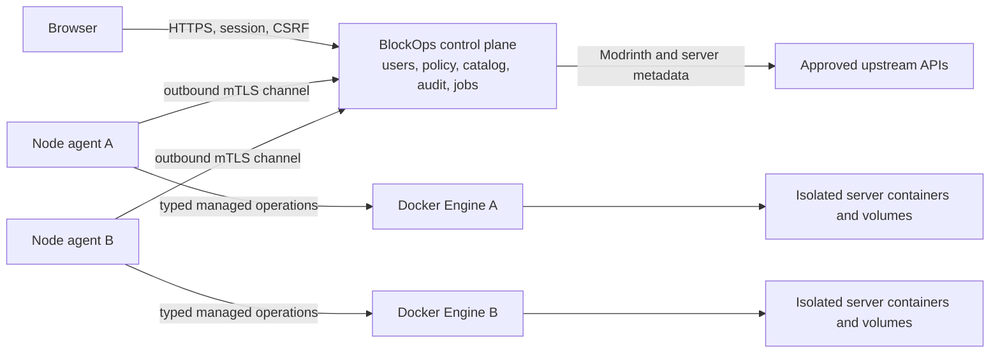

# Roadmap

BlockOps will grow from a secure single-server dashboard into a self-hosted Minecraft fleet manager. It will keep the existing Go control plane, React interface, typed HTTP APIs, bounded WebSocket streams, and audit model. The product will add multiple managed servers and nodes without becoming a browser shell or exposing arbitrary Docker access.

[VoxelDash](https://github.com/gnmyt/VoxelDash) provides product inspiration for server provisioning, Modrinth integration, file management, schedules, server settings, game rules, richer player views, and performance history. BlockOps will implement those capabilities around explicit server roots, pinned runtime templates, resource-scoped permissions, and authenticated node agents.

The sequence below follows dependencies and risk, not calendar dates. A phase starts only after the previous phase meets its exit criteria.

## Product rules

- Keep the browser connected only to the central control plane. It never connects to Docker, node agents, RCON, or server files directly.
- Give every server its own identity, data root or volume, port allocation, credentials, resource limits, permissions, and audit history.
- Prefer typed operations over arbitrary commands, paths, images, mounts, container names, or download URLs.
- Treat local users, browser sessions, API tokens, and node identities as separate security principals.
- Resolve software and Modrinth artifacts from approved upstream APIs, pin immutable versions, and verify hashes before installation.
- Detect capabilities and show unavailable states instead of guessing across Vanilla, Paper, Purpur, Spigot, Fabric, Forge, and NeoForge.
- Require a delivery brief, threat model, migration plan, and runnable integration check for every phase.
- Do not assign dates until project capacity and release cadence are known.

## Current baseline

The MVP already provides Argon2id-backed local accounts, revocable HttpOnly sessions, CSRF protection, login throttling, three roles, live monitoring, bounded console streaming, RCON commands, player controls, safe world operations, local backups, constrained lifecycle actions, encrypted RCON credential rotation, and an audit log for one configured Docker server.

The current authentication is real authentication. Fleet management expands it with resource-scoped authorization, stronger login options, and machine identity. It does not replace it with a shared panel password or trust browser-supplied roles.

## Engineering track: Bun, BlockOps UI, and performance

BlockOps will also serve as a measured experiment in Go, React, and Bun 1.4. Go remains the production control plane. React runs in the browser. Bun owns JavaScript package management, workspace commands, developer tools, and controlled build experiments.

This track starts after FE-28 records the current pnpm, Rsbuild, browser, and bundle baselines. Its required stages finish before Phase 1 is considered complete. Optional Bun experiments can continue beside product work, but they cannot block roadmap features without measured evidence of a product problem.

```text
FE-28 baseline
  -> E1 Bun migration
  -> E2 Bun build and test toolchain
  -> E3 packages/ui extraction
  -> E4 UI evolution
  -> E5 performance workflow
  -> Phase 1 release proof
```

### Rules for the experiment

- Keep Go responsible for HTTP, WebSockets, authorization, sessions, SQLite, Docker, RCON, archives, backups, and production scheduling.
- Use Bun only for development and frontend asset production. Do not add a Bun production service between the browser and Go.
- Replace pnpm, Rsbuild, and Vitest with Bun.
- Keep Playwright, TypeScript typechecking, ESLint, dependency-cruiser, and Knip. Bun runs these tools but does not replace the guarantees they enforce.
- Compare the same commit, dependency graph, workload, machine, and build mode. Record tool versions and warm or cold cache state with every result.
- Optimize only a measured bottleneck. Keep before and after results, and revert changes that do not produce a repeatable benefit.
- Create benchmark and profile directories only when the first runnable workload produces an artifact for them.

### E1: migrate package management and commands to Bun

**Outcome.** A pinned Bun 1.4 release becomes the only JavaScript package manager and the normal entry point for frontend and workspace commands.

#### Work

- Capture clean and warm pnpm install times, peak memory where available, the dependency graph, the production bundle, and the complete verification result before migration.
- Convert `frontend/pnpm-lock.yaml` to `bun.lock` in an isolated migration branch or worktree. Keep the pnpm lockfile until the Bun result passes every gate.
- Add a root private workspace for `frontend` and `packages/*`. Do not include the Go backend in the JavaScript workspace.
- Use Bun's isolated linker so undeclared dependencies continue to fail instead of becoming accidental imports.
- Audit blocked lifecycle scripts. Add only packages whose install scripts the repository requires to an explicit `trustedDependencies` list.
- Replace package, Docker, Make, CI, and documentation commands with their Bun equivalents in one migration change.
- Use `bun install --frozen-lockfile` or `bun ci` in CI. Verify clean installs on Linux and macOS before deleting `pnpm-lock.yaml`.
- Keep package scripts readable. Use `bun run --parallel` only where concurrent processes or independent checks save measured time.

#### Exit criteria

- Clean and warm installs complete from `bun.lock` without changing it.
- The existing typecheck, lint, Vitest, dependency-cruiser, Knip, Rsbuild, Playwright, Go embedding, Docker image, and deep-link checks pass.
- CI and a fresh local checkout resolve the same dependency versions.
- The trusted dependency list contains only reviewed packages with required lifecycle scripts.
- The migration report records install time, peak memory where available, compatibility findings, and rollback commands.
- pnpm files and commands are deleted only after these checks pass. The repository never keeps two active package managers.

#### Rollback

Revert the single migration change and restore the preserved pnpm lockfile and commands. The experiment must not require application-code changes merely to make Bun appear compatible.

### E2: replace the frontend build and test tools with Bun

**Outcome.** Bun builds and serves the React application and runs its unit and component tests. Playwright continues to prove browser journeys.

#### Build and development work

- Replace Rsbuild's HTML, React, TypeScript, CSS, assets, development server, and production build responsibilities with Bun's HTML entrypoint and bundler.
- Use Bun's Tailwind plugin instead of the PostCSS integration if it produces the required Tailwind v4 output.
- Preserve development proxying for HTTP and WebSocket requests to the Go control plane. Any Bun development server remains local tooling and ships in no production image.
- Preserve hashed production assets, the `dist` layout consumed by Go, deep-link behavior, browser support, font and image handling, minification, and useful development source maps.
- Enable Bun's built-in React Compiler only after the plain Bun build matches current behavior. Keep it when profiling shows no regression and the existing test suite passes.
- Generate Bun JSON and Markdown metafiles for bundle analysis.

#### Test work

- Port Vitest imports, setup, mocks, fake timers, DOM environment, and watch commands to `bun:test` without weakening assertions.
- Keep React Testing Library, user-event, MSW, and jest-dom unless Bun provides the same required behavior directly.
- Run the suite serially first. Enable `bun test --parallel` only after shared MSW, DOM globals, ports, and temporary files prove isolated.
- Keep the existing Playwright journey and configuration. Run it through Bun workspace commands without changing its assertions.

#### Exit criteria

- `@rsbuild/core`, `@rsbuild/plugin-react`, Vitest, and their configuration files are deleted.
- Bun development mode supports React updates and the Go API and WebSocket connections used by the application.
- Bun's production output loads through the embedded Go server, including direct route loads and hard refreshes.
- All existing unit and component assertions pass under `bun:test`.
- The production bundle and representative render workloads have no unexplained regression from the FE-28 baseline.
- The existing Playwright journey passes against Bun development and production builds.

#### Rollback

Land package management, bundling, unit tests, and browser automation as separate verified changes. Revert only the replacement that fails its gate.

### E3: extract the first-party BlockOps UI package

**Outcome.** `packages/ui` owns reusable BlockOps interface components built with Base UI behavior and Tailwind CSS. Product features remain in `frontend`.

#### Work

- Start from the reusable components that already exist in `frontend/src/components/ui`. Do not design an empty component catalog.
- Move a component only when at least two product call sites need the same behavior or when the component defines a deliberate BlockOps-wide interaction rule.
- Keep feature components such as player, backup, world, console, and server views inside their features.
- Let Base UI own focus, keyboard, popup, dialog, and other interaction behavior. Let BlockOps own component APIs, variants, tokens, density, and visual design.
- Use shadcn as source and reference material. Review generated code, remove unused variants and dependencies, then treat the remaining code as BlockOps-owned.
- Start without a separate publishing pipeline or component documentation application. The frontend consumes the workspace package directly.
- Keep the public exports named and small. Do not expose Base UI internals or a generic styling configuration object.

#### Exit criteria

- The package has no Minecraft or feature-specific components.
- Every moved component retains keyboard behavior, focus visibility, accessible names, disabled behavior, and destructive-action semantics.
- The frontend has one token source and no duplicate primitive implementation.
- The workspace build, tests, dependency boundaries, production bundle, and embedded Go UI pass.

### E4: evolve the interface

**Outcome.** BlockOps has a distinct, dense interface for server operations without rewriting working feature logic.

#### Work

- Define a small semantic token set for backgrounds, surfaces, borders, text, status colors, radius, shadow, spacing, and typography.
- Establish the shell, navigation, responsive layout, tables, forms, dialogs, notices, loading states, and empty states before polishing individual feature pages.
- Migrate one visible surface at a time. Preserve its HTTP calls, query ownership, permissions, and error behavior unless the active ticket changes them explicitly.
- Check both themes, keyboard-only use, focus restore, narrow screens, reduced motion, screen-reader names, and destructive confirmations.
- Measure the bundle and render behavior after each meaningful component group. Do not accept a visual rewrite that causes an unexplained regression.

#### Exit criteria

- The interface uses `packages/ui` for shared behavior and feature components for product concepts.
- No feature styling returns to global CSS.
- The critical operator journeys pass visual, keyboard, mobile, permission, and unavailable-integration checks.
- Bundle and render changes have recorded comparisons against the FE-28 baseline.

### E5: make performance reproducible

**Outcome.** Contributors can reproduce backend, WebSocket, frontend, bundle, and Bun-tooling measurements with a small set of documented commands.

#### Go work

- Add focused `go test -bench` workloads only for code with meaningful volume or contention, starting with bounded console fan-out, WebSocket broadcast, archive validation, and bounded audit queries.
- Add an opt-in development pprof listener bound to loopback. Keep it disabled by default and separate from the authenticated production listener.
- Capture CPU, heap, allocation, goroutine, mutex, and block profiles under representative workloads.
- Evaluate PGO only after a repeatable workload exists. Do not commit a profile generated from synthetic idle traffic.

#### Frontend work

- Use production builds and browser tooling to measure the players table, console growth, live metrics, route loading, DOM count, memory, and interaction latency.
- Use React profiling to locate render work. Use Playwright for repeatable browser workloads and accessibility-sensitive user journeys.
- Record total output, JavaScript, initial JavaScript, lazy chunks, CSS, fonts, and the largest dependencies.
- Set regression budgets from repeated baseline samples with documented tolerance. Keep noisy timing checks off shared pull-request runners.

#### Bun work

- Use Bun CPU and heap profiles for Bun-based scripts and developer tools. Do not present Bun runtime profiles as browser or Go profiles.
- Use Bun to orchestrate repeatable workloads and generate Markdown summaries from machine-readable results.
- Use Bun build metafiles to explain bundle composition and dependency chains.
- Use Playwright and browser-native profiling data for React, rendering, and interaction measurements.
- Use `Bun.Terminal` only when a real interactive profiling or development workflow requires a pseudo-terminal.
- Provide `bun perf` only after at least one useful workload exists. Add narrower commands as real measurements earn them.

#### Exit criteria

- Every published performance claim links to a command, workload, raw result, tool versions, and machine description.
- A contributor can compare a branch against a baseline without editing product code.
- Deterministic verification stays separate from hardware-sensitive performance checks.
- Profiling adds no public endpoint and does not weaken validation, authorization, or bounded buffers.

The experiment succeeds when Bun owns package management, the frontend build, and frontend tests; `packages/ui` makes shared interface behavior easier to maintain; and measured changes improve a representative workload. Scheduled Minecraft operations remain in Go because Go owns authorization, persistence, locking, and audit.

## Target architecture



The control plane remains a single deployable instance at first. Each node runs one containerized BlockOps agent. Agents initiate their connection to the control plane, so nodes need no public management port. The agent is privileged because it controls Docker, but its protocol accepts only BlockOps server specifications and operations. It has no shell, exec, arbitrary image, arbitrary bind mount, or arbitrary container target endpoint.

## Phase 1: prove and ship the current product

**Outcome.** An operator can deploy a tagged BlockOps release beside a supported real server and verify every existing integration before the fleet model changes persistence and authorization.

### Scope

- Add a disposable Docker environment using a real Paper server, private RCON, a shared world volume, and the Docker guard.
- Add a safe smoke journey for overview data, player discovery, `list`, a consistent backup, and backup download.
- Keep stop, restore, and world replacement in an explicit destructive test profile.
- Finish Compose portability checks for host ingress, volume ownership, Docker guard health, and existing-volume behavior.
- Publish signed, versioned images with SBOMs, provenance attestations, and digest-pinning instructions.
- Add audit pagination and redacted export.

### Exit criteria

- One documented command passes the safe integration journey on Linux CI and Docker Desktop.
- Every Compose service reports an accurate health state.
- The release workflow produces a pinned image and verifiable supply-chain metadata.
- No real-integration test depends on the mocked unavailable-integration Playwright journey.

## Phase 2: fleet identity and authorization

**Outcome.** Users and nodes have explicit identities, and every operation is authorized against a specific server before multi-server provisioning exists.

### Scope

- Replace global role checks with permissions scoped to server resources while preserving administrator, operator, and viewer defaults.
- Let administrators assign users to individual servers. Global owners manage users, nodes, templates, and server creation.
- Keep local Argon2id accounts and revocable sessions. Add optional passkeys/WebAuthn, recovery codes, and TOTP only after reviewed enrollment and recovery flows exist.
- Add optional OpenID Connect for installations that already run an identity provider. Map immutable issuer and subject identifiers, not email addresses, to BlockOps users.
- Add hashed, expiring API tokens with explicit server and action scopes for automation. Show each token once and support immediate revocation.
- Add short-lived node enrollment tokens. Exchange each token for a unique node certificate, then use mutual TLS with rotation and revocation.
- Include principal, server, node, permission, request or job ID, source, and outcome in every privileged audit event.

### Exit criteria

- Backend tests prove that users cannot enumerate or operate unassigned servers by changing URLs or request bodies.
- Revoking a user session, API token, node certificate, or server assignment takes effect without restarting the control plane.
- Browser permissions remain a usability mirror of backend policy, never the enforcement point.
- Recovery flows cannot bypass MFA or transfer ownership silently.

## Phase 3: multiple servers on one node

**Outcome.** An administrator can create, start, stop, update, and remove several isolated Minecraft servers from one dashboard.

### Scope

- Evolve the Docker guard into a local BlockOps agent with typed create, inspect, start, stop, restart, archive, and remove operations.
- Store a server specification containing name, software, Minecraft version, Java requirement, memory, CPU, storage, game port, RCON settings, EULA acceptance, image digest, and node assignment.
- Start with a fixed runtime image and a closed software enum: Vanilla, Paper, Purpur, Fabric, Forge, and NeoForge.
- Support Spigot through an isolated BuildTools job or a user-supplied verified artifact. Never download unofficial Spigot jars.
- Fetch Vanilla and Paper-family metadata from their official services. Record upstream version and artifact hashes in the server specification.
- Allocate ports from an administrator-configured node range and reject collisions before container creation.
- Create one data volume, backup volume, private network identity, RCON credential, and managed container label set per server.
- Apply explicit CPU and memory limits. Refuse host paths, privileged mode, extra capabilities, device mounts, and user-supplied Docker arguments.
- Present provisioning as a persisted job with progress, cancellation boundaries, failure cleanup, and retry from a known state.
- Require typed-name confirmation for removal and retain a final recovery archive unless the owner explicitly declines it.

### Exit criteria

- Two servers with different software and versions run concurrently without sharing ports, credentials, volumes, logs, backups, or permissions.
- The agent rejects operations against containers without the expected BlockOps ownership labels and server identity.
- A failed provision leaves no running container, allocated port, or untracked partial volume.
- Restarting the control plane or agent resumes or safely fails every unfinished job instead of duplicating work.

### Not included

- Arbitrary container images, environment variables, mounts, or startup commands.
- Automatic placement across nodes.
- Importing an unknown existing container without a reviewed adoption flow.

## Phase 4: Modrinth software catalog

**Outcome.** Administrators can install compatible mods, plugins, and server modpacks without copying unverified URLs into the dashboard.

### Scope

- Search Modrinth by stable project ID, project type, Minecraft version, loader, and server environment.
- Show author, license, supported environment, release channel, disclosure metadata, dependencies, incompatibilities, file size, and selected version before installation.
- Resolve versions against the target server's exact Minecraft version and loader. Never offer a client-only artifact to a dedicated server.
- Download only URLs returned by the configured Modrinth API and restricted to approved Modrinth CDN hosts.
- Verify the declared size and SHA-512 hash before staging an artifact.
- Resolve required, optional, incompatible, and embedded dependencies into a reviewable install plan. Never silently add optional dependencies.
- Stop or restart the server only when the reviewed plan requires it. Create a recovery point before changing managed artifacts.
- Install from a staging directory, atomically move validated files into fixed `mods`, `plugins`, or server-pack paths, and roll back the whole plan on failure.
- Record a per-server lockfile containing project ID, version ID, loader, game version, filename, hash, dependency source, and install time.
- Detect files changed outside BlockOps and mark them unmanaged or modified instead of overwriting them.
- Support `.mrpack` server installation only after validating its index, hashes, paths, expanded size, environment, and `server-overrides` content.
- Offer compatible updates as a reviewed diff. Never auto-update Minecraft, loaders, mods, or plugins by default.

### Exit criteria

- Tests cover dependency cycles, incompatible dependencies, client-only files, malicious filenames, hash mismatch, CDN redirect rejection, archive traversal, interrupted downloads, and rollback.
- Removing a project deletes only artifacts owned by its lockfile and preserves configuration and unrelated files.
- A Fabric mod cannot install on Forge, and a plugin cannot install on Vanilla, even if the browser sends a forged request.
- Every install, update, removal, and rollback produces an audit event and a durable job result.

### Not included

- Arbitrary download URLs.
- CurseForge or SpigotMC resource downloads in the first catalog release.
- Automatic compatibility guesses when upstream metadata is missing.

## Phase 5: virtual file explorer

**Outcome.** Authorized users can manage files inside one server instance without seeing the node host or another server's data.

### Scope

- Jail every request to the selected server's data root. Resolve paths on the agent and reject absolute paths, traversal, links, devices, sockets, FIFOs, and escapes through archives.
- Add paginated directory listing, search within the current server, upload, download, folder creation, rename, move, trash, and restore-from-trash.
- Add a UTF-8 text editor with a conservative size limit, atomic writes, line-ending preservation, and ETag-based conflict detection.
- Stream large uploads and downloads with configured compressed and expanded-size limits instead of buffering them in memory.
- Separate `files.read`, `files.write`, `files.delete`, and `files.sensitive.read` permissions. Define sensitive paths per server type and route structured settings through their dedicated editors.
- Show file type, size, modification time, managed or unmanaged state, and whether a running server may overwrite the file.
- Require a recovery point and explicit confirmation for bulk replacement, archive extraction, or changes to startup-critical files.
- Keep a bounded operation log with actor, paths, byte counts, hashes, and outcome. Never log file contents or secrets.
- Render large directories with DOM virtualization only after measuring a real need. Do not add collaborative diff synchronization or a canvas file tree.

### Exit criteria

- Cross-server and host-path escape tests cover every read and mutation operation, including symlink swaps and archive extraction.
- Concurrent editors receive a conflict instead of silently losing changes.
- A failed write or move leaves either the old state or the new state, never a partial file.
- Users without sensitive-file permission cannot infer protected content through previews, downloads, search, errors, sizes, or hashes.

## Phase 6: multi-node gateway

**Outcome.** One control plane manages servers on several private or remote Docker nodes without exposing node management ports.

### Scope

- Let agents maintain an outbound authenticated channel to the control plane using the node certificate from Phase 2.
- Persist idempotent jobs in the control plane and acknowledge execution by node, server, operation, and attempt ID.
- Add node inventory for agent version, health, capacity, reserved resources, port ranges, running servers, and last contact.
- Let administrators choose a node during provisioning. Add automatic placement only after resource accounting proves reliable.
- Stream bounded job progress, console lines, and metrics over the existing HTTP and WebSocket model. Do not add gRPC or WebTransport without measured protocol pressure.
- Fetch large upstream artifacts on the target node from a signed install plan so they do not traverse the browser or remain buffered in the control plane.
- Support certificate rotation, node draining, maintenance mode, reconnect with backoff, version compatibility checks, and explicit node removal.
- Fail closed when a node is offline. Display last-known state with its timestamp and never present it as live.

### Exit criteria

- A compromised or revoked node cannot impersonate another node, request user sessions, or operate servers assigned elsewhere.
- Replayed jobs cannot create a second server, repeat a deletion, or install an artifact twice.
- Losing the control-plane connection does not stop running Minecraft servers or corrupt an active atomic operation.
- Integration tests cover reconnects, duplicate delivery, stale agents, clock skew, certificate expiry, and partial node failure.

### Not included

- High-availability control-plane replicas.
- Kubernetes orchestration.
- Billing, quotas sold to customers, or untrusted tenant isolation.
- Direct browser-to-agent connections.

## Phase 7: fleet operations

**Outcome.** Operators can automate recovery and diagnose incidents across the managed fleet without adding a general task runner.

### Scope

- Add per-server backup retention by count and age, dry-run visibility, free-space checks, checksums, and scheduled backups.
- Add a visual recovery timeline over verified whole-server recovery points. Keep restores atomic and do not swap individual region files.
- Persist bounded CPU, memory, disk, player-count, server-state, TPS, and MSPT history when each source is available.
- Correlate lifecycle actions, installs, file changes, backups, warnings, and audit events with metric timelines.
- Parse crash reports and read-only spark results into deterministic findings linked to source evidence. Do not provide heuristic one-click fixes.
- Add typed broadcast and restart schedules only after backup scheduling proves the execution, timezone, missed-run, and audit model.
- Add curated MOTD, `server.properties`, game-rule, time, weather, and difficulty controls.
- Add richer player history and plugin-backed capabilities only through explicit, versioned integrations.

### Exit criteria

- Retention places tested limits on backup storage, metric storage, and query time.
- Missing or malformed integration data creates timestamped gaps, not zeroes or fabricated values.
- Scheduled and manual work share per-server locks and cannot overlap destructively.
- Diagnostic findings remain explanatory. They never execute commands or mutate files automatically.

## Later integrations

- Remote backup providers with encryption, retention, restore verification, and provider-specific credentials.
- LuckPerms as the first plugin-specific permissions integration.
- Curated CurseForge support after its API, distribution terms, authentication, and hash guarantees receive a separate design.
- Bedrock Dedicated Server management as a separate runtime and integration model.
- Localization after product copy and error contracts stabilize.
- An installable PWA only if offline-safe read behavior and session handling have a concrete use case.
- High-availability control-plane storage only after one control plane becomes a measured availability limit.

## Upstream contracts

- [Modrinth search](https://docs.modrinth.com/api/operations/searchprojects/) supplies project type, loader, Minecraft version, server-environment, license, and disclosure filters.
- [Modrinth versions](https://docs.modrinth.com/api/operations/getprojectversions/) supply immutable version IDs, dependencies, loaders, game versions, file sizes, URLs, and SHA-512 hashes.
- [Modrinth's `.mrpack` format](https://support.modrinth.com/en/articles/8802351-modrinth-modpack-format-mrpack) defines the index and server override layout that BlockOps must validate independently.
- [Paper's downloads service](https://docs.papermc.io/misc/downloads-service/) is the approved Paper artifact source.
- [Spigot BuildTools](https://www.spigotmc.org/wiki/buildtools/) is the supported path for producing a Spigot server jar. BlockOps must not redistribute or download unofficial builds.

## Explicitly rejected

- Browser shell, SSH, SFTP, Docker exec, or host command execution.
- Arbitrary host paths, container images, Docker options, startup commands, scripts, webhooks, or download URLs.
- Direct editing of another server's files or shared mutable server roots.
- Automatic Minecraft, loader, mod, or plugin upgrades without compatibility review and rollback.
- Partial `.mca` region restoration presented as a safe whole-world recovery.
- AI-generated operational changes without deterministic validation and explicit operator approval.
- Commercial hosting, billing, reseller, or hostile customer-tenancy features.
- Hytale support before a stable server API and a separate product brief exist.

Future work must add narrow interfaces for its own operations. It must not turn the node agent, file explorer, software catalog, or scheduler into a generic remote administration surface.
